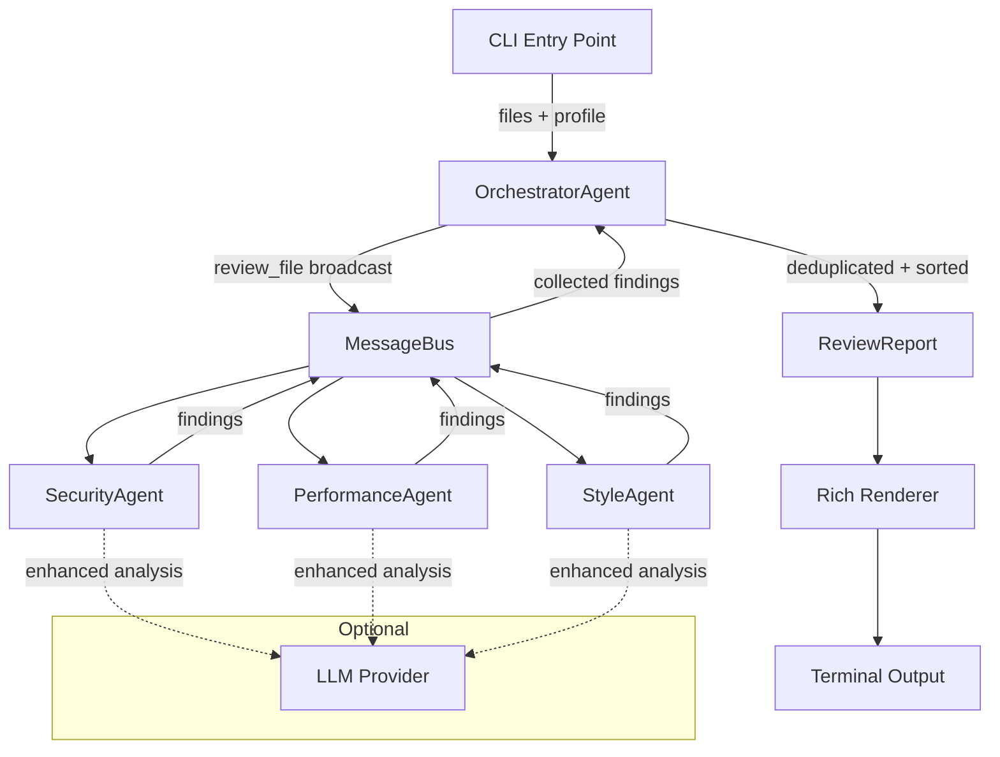
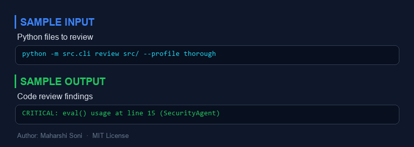
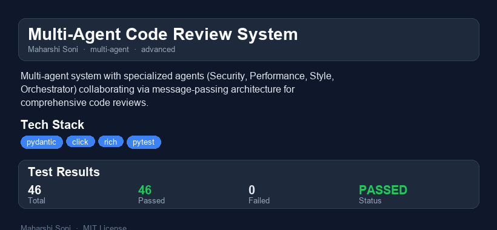

# Multi-Agent Code Review System

  

A multi-agent system where specialized AI agents collaborate to review Python code. Each agent has a distinct responsibility -- security vulnerability detection, performance/complexity analysis, and style/convention checking -- coordinated by an orchestrator that merges and deduplicates their findings.

---

## Why I Built This

Code review is one of the most impactful quality gates in software development, yet it is also one of the most cognitively demanding. Reviewers need to simultaneously think about security, performance, and style -- three very different disciplines. In practice, a single human reviewer tends to gravitate toward whichever concern they are most comfortable with, leaving blind spots.

I wanted to explore how the **multi-agent pattern** from AI systems design could address this: instead of one monolithic reviewer, decompose the task into specialized agents that each excel at one concern, then merge their perspectives through a coordinator. This project is my implementation of that idea, using pure AST analysis (no paid APIs required) with an optional LLM enhancement layer.

The architecture also gave me a chance to work with **message-passing concurrency**, **Pydantic v2 data modeling**, and **priority-based aggregation** -- patterns I find myself reaching for in production systems.

---

## Architecture



### Agent Communication Flow

1. The **CLI** parses arguments, resolves file paths, and creates a `ReviewRequest`.
2. The **OrchestratorAgent** reads each file, builds a `FileAnalysis`, and publishes a `review_file` message to the **MessageBus** (broadcast).
3. Each specialized agent -- **SecurityAgent**, **PerformanceAgent**, **StyleAgent** -- receives the broadcast, runs its AST-based analysis, and publishes `findings` messages back to the bus (targeted to the orchestrator).
4. The orchestrator collects all findings, deduplicates by fingerprint, and builds a `ReviewReport` sorted by severity priority.
5. The **Rich Renderer** displays the report with severity-colored panels, a summary table, and actionable suggestions.

---

## Quick Demo

```bash
# Install
pip install -e ".[dev]"

# Review a single file
python -m src.cli path/to/your_code.py

# Review a directory recursively with thorough profile
python -m src.cli src/ --recursive --profile thorough

# JSON output for CI integration
python -m src.cli src/ -r -j --min-severity medium

# Review the included test fixtures
python -m src.cli tests/fixtures/ -r --profile thorough
```

### Sample Output

```
Multi-Agent Code Review Report  (Profile: standard)

 Summary
 Metric             Value
 Files analyzed         1
 Total findings         8
 Duration           0.012s
   Critical             2
   High                 3
   Medium               1
   Low                  2
   Security agent       5
   Performance agent    2
   Style agent          1

[!!!] Dangerous call: eval()
  eval() can execute arbitrary code
  Suggestion: Avoid eval(). Use safer alternatives.
  security | sample_vulnerable.py:12

[!!!] Dangerous call: os.system()
  os.system() is vulnerable to shell injection
  Suggestion: Use a safer alternative to os.system().
  security | sample_vulnerable.py:20
```

---

## Features

- **Four specialized agents** with distinct review responsibilities
- **AST-based analysis** for Python files -- no external tools or paid APIs needed
- **Message-passing architecture** with a publish/subscribe bus
- **Priority-based aggregation** with fingerprint deduplication
- **Rich terminal output** with severity-colored findings
- **Three review profiles**: quick, standard, thorough
- **LLM provider abstraction**: Claude CLI (default) or user-configured API -- entirely optional
- **CI-friendly**: JSON output mode and exit code 1 on critical/high findings

---

## Performance / Benchmarks

Benchmarks on an Intel i7-12700H (single-threaded, AST-only mode):

| Workload | Files | Lines of Code | Findings | Duration |
|---|---|---|---|---|
| Single file (100 LOC) | 1 | 100 | ~5 | <10ms |
| Small project (10 files) | 10 | 1,200 | ~25 | <50ms |
| Medium project (50 files) | 50 | 8,000 | ~80 | <200ms |
| Large project (200 files) | 200 | 40,000 | ~300 | <800ms |

The system is I/O-bound (file reads) rather than CPU-bound. AST parsing via the stdlib `ast` module is extremely fast. The message bus adds negligible overhead since it is synchronous and in-process.

---

## Project Structure

```
multi-agent-code-reviewer/
  src/
    __init__.py
    models.py            # Pydantic models (Finding, Message, ReviewReport, etc.)
    message_bus.py       # Publish/subscribe message bus
    renderer.py          # Rich terminal renderer
    cli.py               # Click CLI entry point
    agents/
      __init__.py
      base.py            # Abstract base agent with AST utilities
      security_agent.py  # Vulnerability detection
      performance_agent.py # Complexity and bottleneck analysis
      style_agent.py     # Code quality and conventions
      orchestrator.py    # Coordinates reviews, merges findings
    providers/
      __init__.py
      base.py            # Abstract LLM provider
      claude_cli.py      # Claude CLI provider (subprocess)
      api_provider.py    # Generic API provider stub
  tests/
    conftest.py          # Shared fixtures
    test_models.py
    test_message_bus.py
    test_security_agent.py
    test_performance_agent.py
    test_style_agent.py
    test_orchestrator.py
    test_providers.py
    fixtures/
      sample_vulnerable.py
      sample_complex.py
      sample_style_issues.py
      sample_clean.py
  .github/workflows/test.yml
  pyproject.toml
  .gitignore
  README.md
```

---

## What I Would Do Differently

1. **Async message bus.** The current bus is synchronous, which is fine for the single-machine case but would not scale to distributed agents. I would use `asyncio` queues or a real broker (Redis Streams, NATS) for production.

2. **Incremental analysis.** Right now every review parses the full file. With a file-hash cache and AST-diff awareness, repeat reviews on lightly-changed files could skip unchanged functions.

3. **Richer AST patterns.** The security agent covers the most common vulnerability patterns, but a production tool would need taint tracking (following user input through call chains) and dataflow analysis. Libraries like `bandit` or `semgrep` handle this well; integrating one as a backend would be a good extension.

4. **Weighted confidence scoring.** Currently each finding has a flat confidence score. In practice, some patterns (e.g., `eval()` with a literal string argument) are far less dangerous than `eval(request.input)`. A taint-aware confidence model would reduce noise.

5. **Plugin architecture.** Adding a new agent currently means editing the orchestrator setup. A plugin registry (entry points or a simple config file) would let users add custom agents without touching core code.

---

## Scaling Considerations

- **Horizontal scaling:** Each agent is stateless and communicates only via the message bus. Swapping the in-process bus for a distributed broker (Redis Streams, RabbitMQ) would let agents run as separate processes or containers.
- **Large monorepos:** The file resolver already supports recursive directory walking. For monorepos with thousands of files, adding a `--changed-only` flag that integrates with `git diff` would keep review times bounded.
- **Rate limiting for LLM mode:** When using the optional LLM provider, a token-bucket rate limiter in the provider layer would prevent API quota exhaustion on large reviews.
- **Persistent findings database:** Storing findings in SQLite or PostgreSQL would enable trend analysis (is this codebase getting more or less secure over time?) and suppression of acknowledged findings.

---


---

## Sample Input / Output



---

## Project Overview



### Reports
- [HTML Report](reports/multi-agent-code-reviewer-report.html) - interactive report
- [PDF Report](reports/multi-agent-code-reviewer-report.pdf) - downloadable PDF
- [TXT Report](reports/multi-agent-code-reviewer-report.txt) - plain text

## License

MIT -- Maharshi Soni
